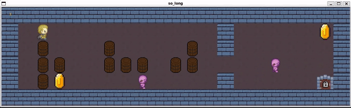

# so_long

# Description
This is the 6th project in 42 Lisbon coding school. My so_long is a part of my personal coding journey and exploration. This project was inspired by the common core curriculum at my coding school. The primary objective is to create a proof of concept for a 2D game utilizing the [MinilibX](https://github.com/42Paris/minilibx-linux) graphic library and the ANSI C language.

In this project, I've implemented a simple game concept where the player's task is to collect all the items scattered across the map and reach the exit. The player can only move horizontally and vertically. The map consists of walls, empty spaces, collectible items, and the exit. Beware! The player loses if they collide with an enemy.

Feel free to explore and use this project for educational purposes. You are welcome to adapt and modify it to suit your needs.

If you are a fellow learner, consider this project as a reference. However, always keep in mind: you need to comprehend the code to use it effectively. Additionally, ensure that it aligns with the current topics you are studying, as it might not be fully compliant with the latest subjects.

# MinilibX
The [MinilibX](https://github.com/42Paris/minilibx-linux) serves as a straightforward X-Window programming API in C. It's designed with students in mind, making it suitable for beginners who are diving into graphical programming.

# Code Style
The code style adhered to in this project follows the [Norminette](https://github.com/42School/norminette), created by my coding school. This style is consistently used across all ANSI C projects within the school's context.

# Map Structure

|Character|Description|
|----|----|
|1|Wall|
|0|Floor|
|C|Collectable|
|B|Barrel|
|P|Player|
|E|Exit|
|G|Goblin|

Map example:<br />
```
111111111111111111111
1P00000000000100000C1
10B000B0000B010000001
10BB00BBB0BB000G00001
10BC00000G000100000E1
111111111111111111111
```

# Installation
Before compiling the project it is necessary to install MLX library a guide can be found in the [MinilibX](https://github.com/42Paris/minilibx-linux) repository.
```
git clone git@gitlab.com:dinis-petrukha/so_long.git
```
To open and play the game you just need to use:
```
make 1
```
* Open the map01.ber
```
make 2
```
* Open the map02.ber
```
make 3
```
* Open the map03.ber
```
make 4
```
* Open the map04.ber

# Usage
Once the project has been successfully compiled, an executable file named "so_long" will be generated. To initiate the game, execute the following command, passing the desired map as an argument:

Example:
```
./so_long map/map1.ber
```
